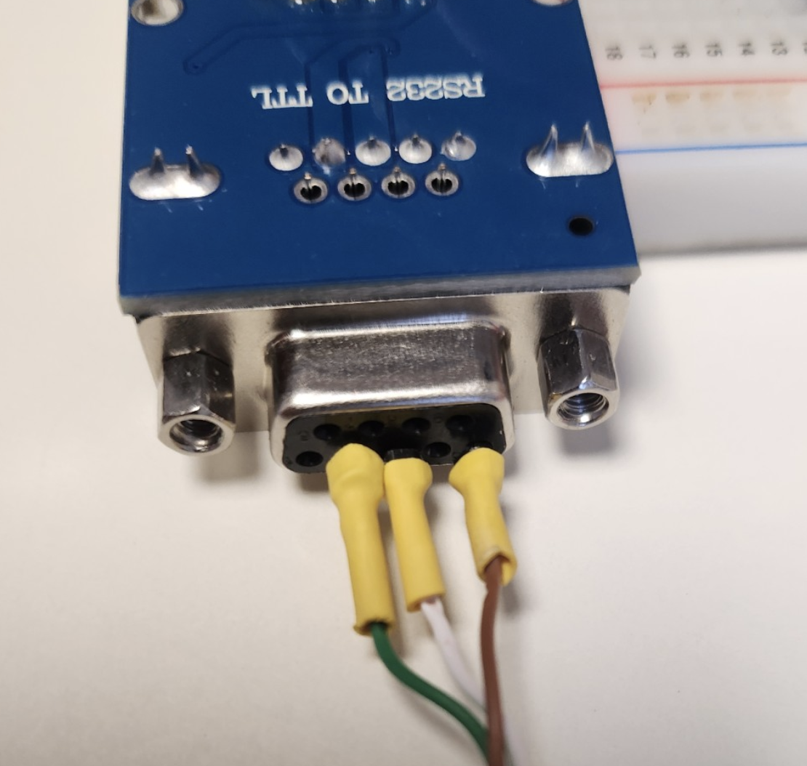
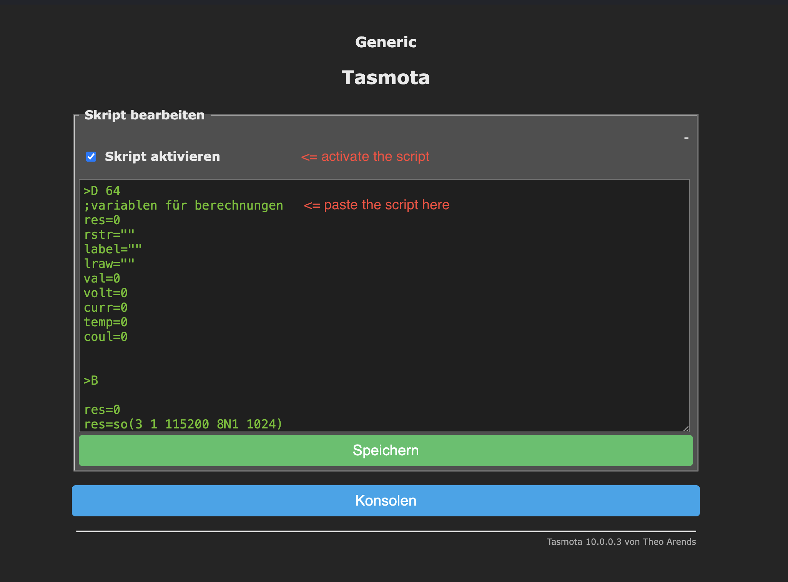
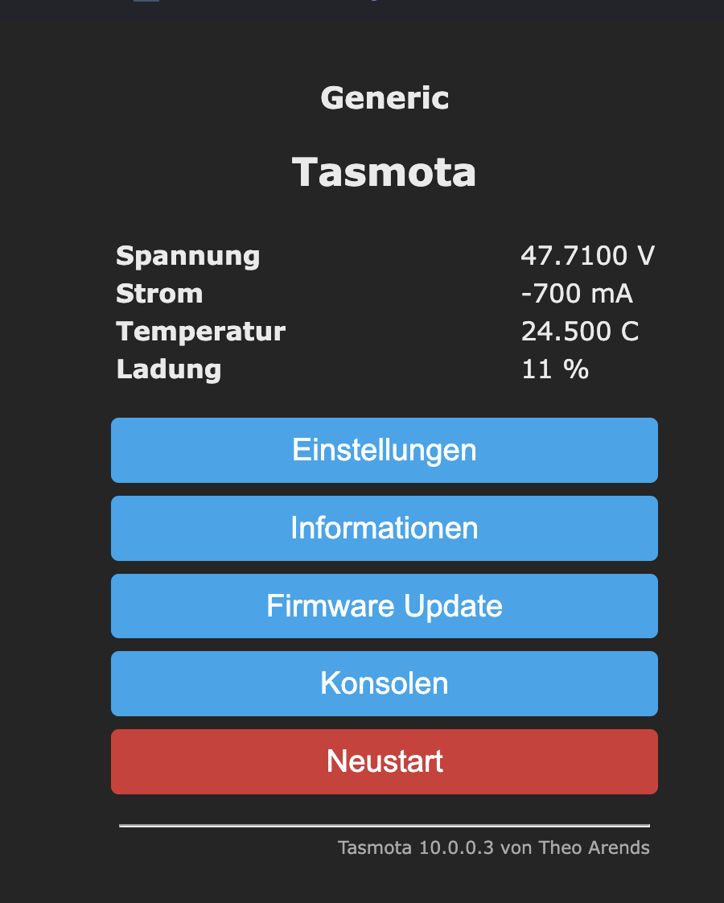
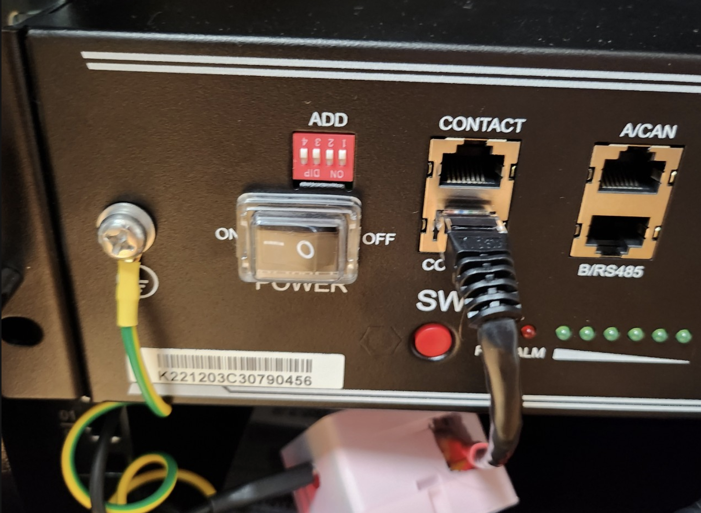
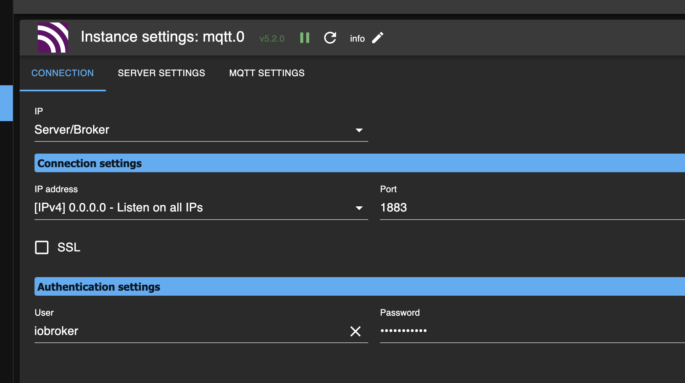
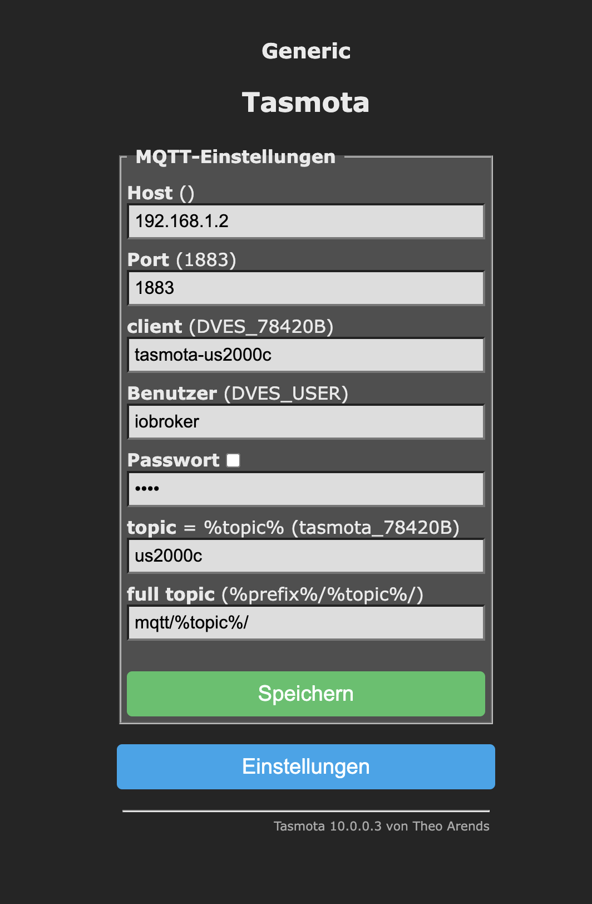
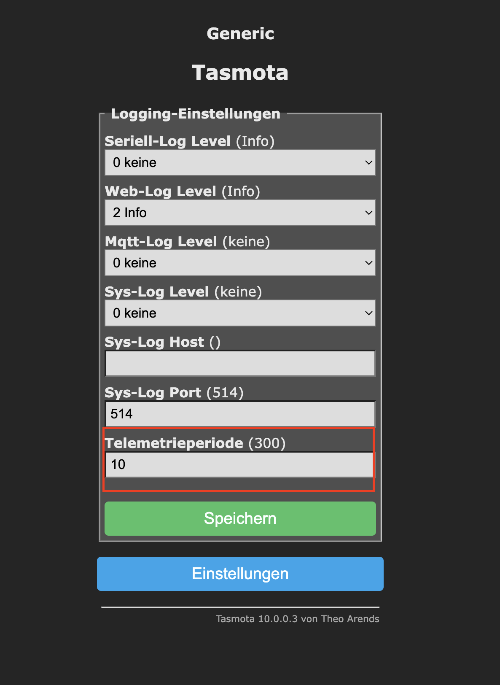
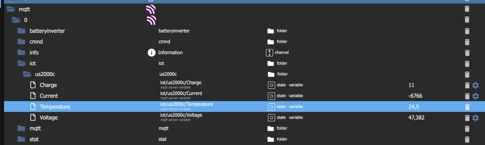

[TOC]

This guide is written to enable reading the battery information of a Pylontech `US2000C` and sending the data to IoBroker via `MQTT`. 

This is done by using a special Tasmota build and some Arduino hardware as well as an RS232 to TTL adapter.

I used the pre-compiled firmware from [this thread](https://forum.creationx.de/forum/index.php?thread/3526-pylontech-us2000-mit-tasmota-auslesen/&pageNo=1) (kudos to [gemu2015](https://forum.creationx.de/index.php?user/1660-gemu2015/)  and [opferwurst](https://forum.creationx.de/index.php?user/1593-opferwurst/)) but you can compile your own version of Tasmota following the instructions from the original thread.

# Requirements

- Pylontech US2000C battery (obviously)
- ESP8266 (e.g. d1 mini or NodeMCU)
- RS232 Adapter [MAX3232](https://www.amazon.de/dp/B09DYDFZRW)
- Standard RJ45 cable (T568B order)
- Some cable, soldering iron, shrink tubes and maybe a glue gun

# Uploading the firmware

Since I am using a Mac, I install the audio-cli using `home-brew`. For Windows and Linux you need to use a different method.

All commands are also available as ready-to-use shell scripts in this repository.

## Setup Script

```shell
$ brew install arduino-cli
$ arduino-cli core install esp8266:esp8266 --config-file ./.cli-config.yml
```

## Detect your board on the serials

```shell
$ arduino-cli board list
```

Identify the your connected board from the commands output and use it as and argument to upload the binary (e.g. `/dev/cu.usbserial-1440`).

## Uploading the firmware

```shell
$ arduino-cli upload -i firmware.bin -p /dev/cu.usbserial-1440 -b esp8266:esp8266:d1_mini
```

> **Notice**: if the RS232 adapter is already wired up to your board, **this can lead to upload errors**, since the TX / RX channels might cause issues.

# Wiring of the RS232 adapter

We only need the following lines of the RJ45 cable:

- brown
- green
- Green-white

> **Beware**: the wiring of T568A is different and the colors may change 

After successfuly testing it, I fixated the wiring using a hot-glue gun.





# Tasmota Script

Orginally taken from the [thread of opferwurst](https://forum.creationx.de/forum/index.php?thread/3526-pylontech-us2000-mit-tasmota-auslesen/) (many thanks for the information!).  Simply paste the script into the scripting section of your running Tasmota device and save it. Don't forgett to increase the default logging frequency from (default) 300 to a lower interval (e.g. 10).



The script you need to paste is in the script [US2000C_tasmota_script.txt](US2000C_tasmota_script.txt) 

If everything runs fine, you should get the following readings:



# US2000C Settings

All switches in upward position - next to the numbers (should be the factory default)



# Connecting to IoBroker

After you get successful readings from the battery, you can forward those to the IoBroker via MQTT. You need to have a MQTT Host Adapter installed and configured:



Enter the credentials into the MQTT section of Tasmota:



Now configure the logging interval to `10`, so you get frequent readings:



Now you should be able to see the values beeing updated in IoBroker:

